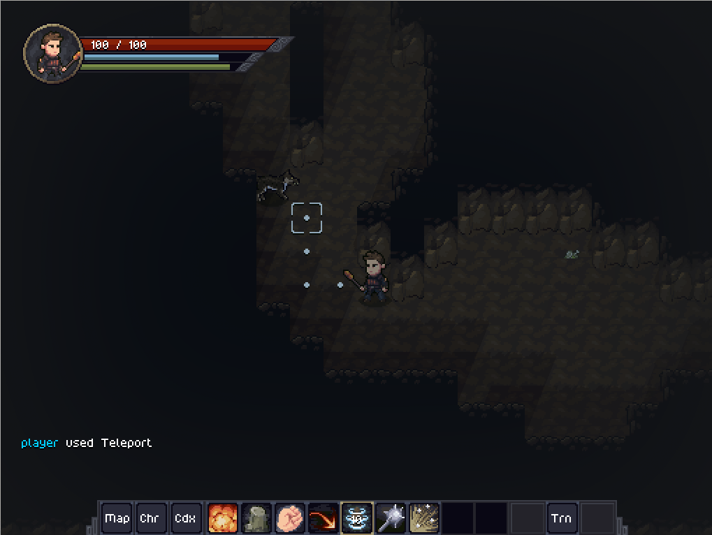

Hi everyone!

Last week, I introduced new combat skills, but combat still wasn't a big part of the gameplay. This week, I focused on bringing combat into the gameplay loop with a dungeon and a miniboss.

The miniboss is a creature called Varningr, which I wont spoil much about just yet.

<h2>Varningrs lair</h2>

The Varningrs lair is the first dungeon added to Tales of Kathay. It's a undeground cave system with wolves and, of course, the Varningr.

Varningrs spawn during history generation, and can attack small cities. The people of these cities might join forces and attack him back.

For the dungeon itself, I had to update the Jigsaw generation algorithm to allow for rotated and mirrored tiles, and also have room requirements, such as "Generate a dungeon with only 1 entrance and only 1 lair".

Some polishing is still necessary before I consider de dungeon complete, but I would say it's 80% there.

<h2>Storyteller</h2>

During the history generation, I introduced the conecpt of a "storyteller". I borrowed the name from Rimworld, although the conecpt is different.

Basically, the storyteller has "desired" parameters, such as number of cities and population, and it nudges the simulation random chances to ensure it stays around those parameters. You can also specify a "strength" to the storyteller, where 1 is a strong nudge, and 0 is completely random.

<h2>Visual tweaks</h2>

I'm starting to do a few visual tweaks to improve the game looks.

So far I added:

<ul>
    <li>Object shadows;</li>
    <li>Creature shadows;</li>
    <li>Creature facing last actions direction;</li>
    <li>Global vignette;</li>
</ul>

In the background I'm also studying and structuring a new rendering backend to allow for more advanced shaders, effects and lighting.

That's it for this now, and see you next week!
