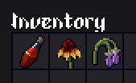
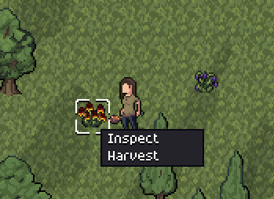

Hello everyone!

As mentioned in the last update, this week I tackled the most scary part of the next version, which was simulating the world as you go. More details below, but I'm quite happy with the results so far!

As per other features, I have also started adding consumables and new equipment. As a reminder, the new features of the next update are:

- Saving and loading;
- Simulate the world as you play;
- Consumables;
- More gear variety;

Most of them are close to being done. Next week, I expect to fix some bugs and improve the game-feel of some new actions. I'm hopeful that I can release version 0.2 until next Friday!

## Simulating the world in real time

This was the main focus of my week, as it was a scary feature to implement.

The main change is that now, every time you sleep in a bed to recover health, 1 day will be simulated for the entire world. This will allow people to age, die, and be born. People will move into new homes, or abandon old ones. Abandoned buildings will age and crumble.

This will happen very slowly, almost imperceptibly, as you play. However, when you return to a town you haven't visited in a while, you'll notice changes.

I made this short time-lapse of 100 years in a small village to show this evolution happening:

<iframe width="560" height="315" src="https://www.youtube.com/embed/181oiQmlrcE?si=jrhpY1h3xK3MpXo6" title="YouTube video player" frameborder="0" allow="accelerometer; autoplay; clipboard-write; encrypted-media; gyroscope; picture-in-picture; web-share" referrerpolicy="strict-origin-when-cross-origin" allowfullscreen></iframe>

## Consumables

I also added this week a new type of item, being consumables. This is for items such as potions, food, etc.

So far, I added three consumables: Health potion (quest reward), Comfrey and Echinacea (Much weaker versions of health regeneration, can be foraged). The health potion will give you a "second wind" during combat, while the flowers are meant more as a recovery between fights.

I also added harvestable plants! This is how you get Comfrey and Echinacea, and it gives the player something to do while exploring.

## More equipment

Finally, I started adding more equipment to the game. I'm not ready to show anything here yet, because the sprites are terrible.

What I can say, is that I plan to add:

- 2 types of helmets
- 1 type of armor (3 total)
- 1 piece of clothing (2 total)
- 1 leg piece (2 total)
- 3 weapon types (6 total)

Conclusion

As mentioned, I feel confident that I can release the update 0.2 until next Friday, the 5th of September.

I have also started planning update 0.3, but I'll leave that for the next devlogs ;)