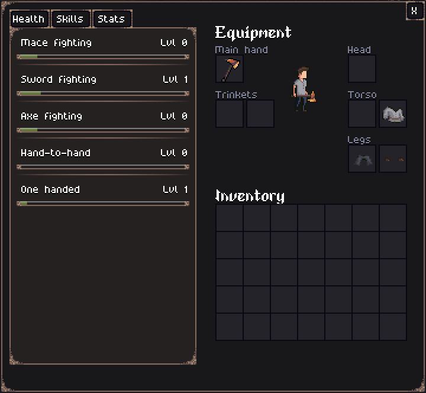

Hello everyone!

This week was very exciting, with the release of version [0.2.0](https://jouwee.itch.io/tales-of-kathay/devlog/1023871/tales-of-kathay-update-020) on [Itch](https://jouwee.itch.io/tales-of-kathay). Also, I would like to say a special thanks to everyone from [Rogue Basin](https://roguebasin.com/) that came to checkout out the game!

Now, about the next update for Tales of Kathay. 

## Skills and leveling up

The main feature I want to work next is the leveling system, which I already got started yesterday.

I want to follow the template of games such as Project Zomboid, Soulash 2, or Skyrim. In those games, you level up your skills by using them, and the overall character level is not as important. In contrast to this format would be a system similar to Avernum or Stoneshard, where you level up in a more general way and spent skill points to improve specific skills. This is a more arcade-y way of managing levels, and I feel it doesn't fit with my vision of a more dark and realistic game.

Leveling up skills will improve your player pertinent stats, but most importantly, will also unlock new abilities to use tactically. For instance, leveling up your "Sword Fighting" skill will reduce the chances of you fumbling your attacks with swords, but might also unlock a new ability that allows you to hit your target with the pommel, dealing a stunned effect.

Currently, the skills I want to implement are:
- Sword fighting
- Mace fighting
- Axe fighting
- One-handed weapon fighting
- Hand-to-hand fighting
- Combat maneuvering

Here's a little preview of the skills UI in game:

## Other improvements

Some other improvements I wanna implement are **diagonal movement** and a **"look" keybind**, allowing the player of looking a little further than the screen allows. I have already played around with this, and I think it will improve exploration and combat-planning.

Another thing I want to work on is polishing the quests and dungeons, as they feel really thrown together, specially the Varningr quest. I'm not sure if I will do this in this update or on a specific one.

This is it for this week, and don't forget to [wishlist Tales of Kathay on Steam](https://store.steampowered.com/app/3939340/Tales_of_Kathay/)!