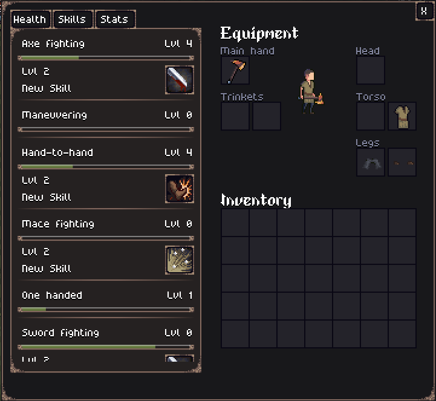
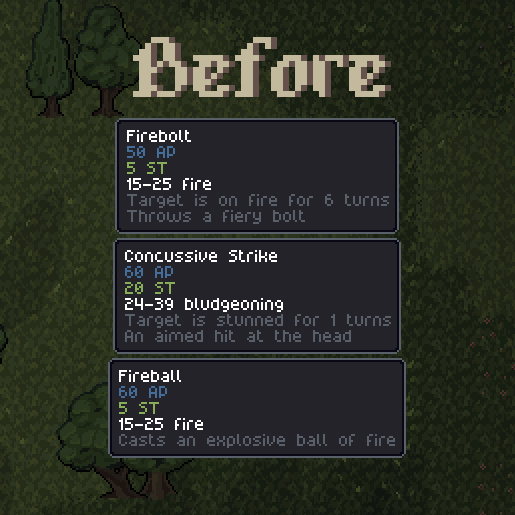
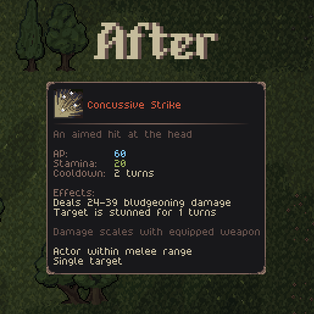

Hello everyone!

This week the work continues on the skill and leveling system. I have also implemented some new features to make combat and general play more fluid, as well as working in some heavy optimizations.

## Skills and leveling up

In the skill system, the main change since last week is that now skills might unlock new abilities on level milestones. The existing melee abilities ("Concussive Strike" and "Bleeding Cut") have been moved to the level 2 requirement of their respective weapon skills.

The plan is to have at least 2 abilities unlocked per skill, one at level 2 and one at level 4. Further leveling a skill will only grante stat bonuses.

One skill that's already implemented is the "Push Kick", unlocked with Hand-to-hand fighting level 2. Here's a gif of the Push Kick in action:

You might have noticed in the video above, but another change I made this week was improving the tooltips of the abilities. They now show pretty much every information that I have in code in a more organized and pleasing way.

## Diagonal movement

Another change I'm testing with is enabling diagonal movement. The "manhattan" movement I had before felt very clunky sometimes. With diagonal movement, it feels way more fluid, but I'm also often surprised of how fast the enemies can reach me now. I'll keep it enabled for now, and tweak balancing with time.

## Blood splatter & Stencil

One last tiny change I made in the game was adding blood splatters when an attack hits. The most interesting part of this is the stencil framework I created to make the blood splatters, which will allow me to add more little effects like these faster!

## Performance improvements

Recently I discovered that the way I'm rendering some images (mainly the tilemaps) is very non-ideal. Basically I made a separate tileset image for every type of tile (grass, dirt, wooden floor, etc), and I draw them in order acordingly. I've done it like this instead of a large image atlas to allow easy modding and expansion in the future. However, this results in a lot of byte exchange between the CPU and GPU. When rendering, everytime a tile changes, the new tileset has to be sent to the GPU.

I'm experimenting with a dynamic image atlas built in-memory. Basically, when the game register the different tilemaps, it adds all of them to a large image that only has to be sent to the GPU once. On my desktop PC (RTX 5060), this resulted in a 3x (from 2.7ms to 900μs) improvement at the cost of a few megabytes of RAM. I'm yet to test in my older and less powerfull notebook, but from preliminary tests I did some weeks ago, I expect something close to 10x increase (30ms to 2-3ms).

## Conclusion

In general, I'm quite happy with the progress I'm doing with the leveling system. I believe next week I'm going to release the changes as version 0.3.

During this "pre-alpha" phase of the game, I believe it makes more sense to release small and frequent updates, so I'll try to do that. 