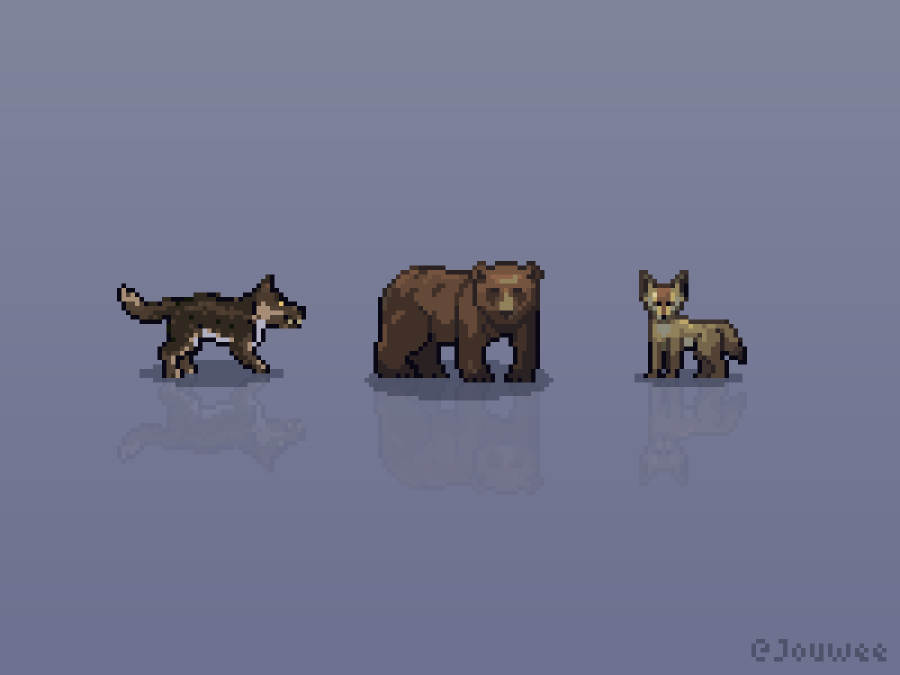
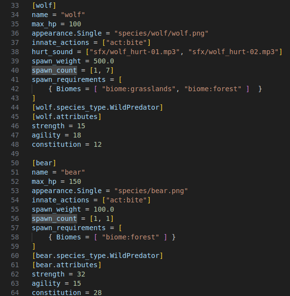

Hello everyone!

After the release of the [Open Alpha 0.3.0](https://jouwee.itch.io/tales-of-kathay/devlog/1038364/tales-of-kathay-update-030) on Itch this Monday, I have immediately started working on the next update.

My goal is to keep this update short and sweet, with the primary goal of adding a trading and money system, as well as adding a little bit of content.

## More enemies variety

The first thing I worked this week was fixing some ugly code I wrote to release the version 0.1 of the Alpha in a quickly manner. Basically, everything about the spawning logic and questing of "killing a pack of wolves" was strictly fixed to wolves. Now, the logic to both spawn the creatures, generate and describe the quest can happen with any species with a "Wild Predator" type.

With this, I added two new species of predators, with different stats and looks: The Bear and the Coyote. The difficulty curve is supposed to be Coyote > Wolf > Bear, which is reflected by the order in which you receive quests (easier first).

Another cool thing I fixed with this change is that the species are now loaded from a config file, which means it's easier for me and (specially) modders to add custom species in the future.

## Trading

I have also started work on the trading mechanic, which is gonna be the glue that connects several other game mechanics together. So far, I don't have anything concrete to share here, so I'll share my vision on how this mechanic is going to work when complete.

Trading will be available with any intelligent creature in Tales of Kathay. You can try to buy whatever they have on them, and try to sell anything back.

People with specialized professions (such as a blacksmith, a tailor, or an alchemist) will work on creating items based on available resources and their skill on that profession. Those items will be stocked in their household and can be purchased by the player, or by other NPCs that desire that item.

Basically, for you to be able to buy a sword in the world, the materials must've been collected by someone, and a skilled blacksmith must've crafted the sword prior to you buying it. This is my goal for every product in the game.

For now, I'm still preparing the backbones of this system, adding value to the items and creating the trading UI. Next week I'll probably be able to share more about trading!

This is it for this week, and don't forget to [wishlist Tales of Kathay on Steam](https://store.steampowered.com/app/3939340/Tales_of_Kathay/)!