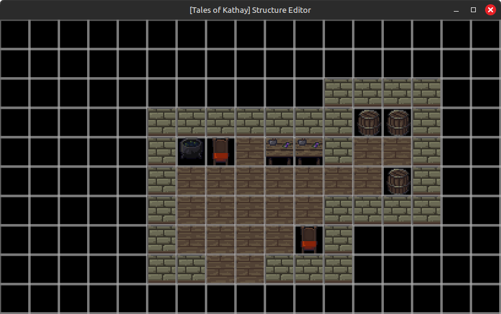
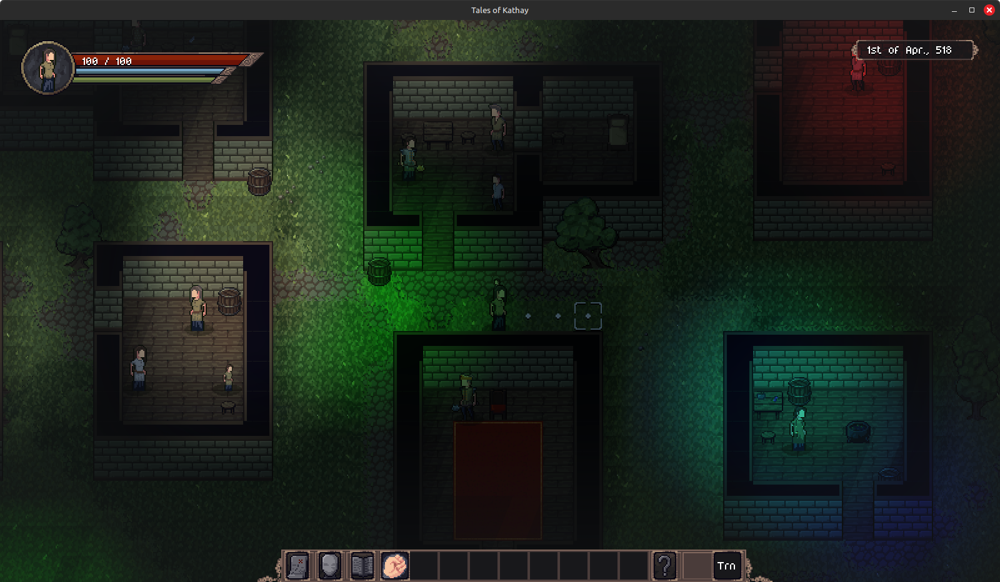

Hello everyone!

This week, the focus of my work was finishing up the trading / shopping mechanic and integrating it into the rest of gameplay. I also went in a small tangent to figure out lighting for the game, and some other quality of life stuff.

With this week's progress, all that's left for version 0.4 are some polishing touches and bug fixes.

# New trailer

Firstly, this week I have created a trailer for the pre-alpha of the game. You can check the trailer below:

<iframe width="560" height="315" src="https://www.youtube.com/embed/DD70xf6vkQU?si=yMtM1zFw4FZuWOYU" title="YouTube video player" frameborder="0" allow="accelerometer; autoplay; clipboard-write; encrypted-media; gyroscope; picture-in-picture; web-share" referrerpolicy="strict-origin-when-cross-origin" allowfullscreen></iframe>

# Trading & Shopping

As mentioned, the focus of this week's progress has been on the trading mechanic.

A good part of the work was with the creation of the trading UI, but I also made it so that blacksmiths are now recognizable, with a special outfit and different house. Yes, the game had blacksmiths before, but they were exactly the same as the other villagers. I also added a new profession, the Alchemist, which will sell potions and spell tomes (for now).

These craftsmen will create items randomly throughout history, that you can then purchase from them. The system is still very bare bones, so NPCs don't buy stuff from them and any craftsmen can make any item, regardless of material and quality. These are points that I intend to address, but they don't greatly affect the gameplay aspect.

Here's a little preview of the trading screen:

<iframe width="560" height="315" src="https://www.youtube.com/embed/DD70xf6vkQU?si=Glb2bYuIQP5R5jLY" title="YouTube video player" frameborder="0" allow="accelerometer; autoplay; clipboard-write; encrypted-media; gyroscope; picture-in-picture; web-share" referrerpolicy="strict-origin-when-cross-origin" allowfullscreen></iframe>

## Devtooling

Another interesting point is that, since I had to create some new buildings (blacksmith and alchemist), I decided to start the makings of a devtool to edit these structures. These tools I create will be release for free as modding tools in the future.

# Lighting

I also went on a bit of an unplanned tangent to figure out a lighting system that I would like to implement in the game. I've been doing this on and off for the past few weeks, often giving up on the system I started because I don't see how it would integrate with gameplay later.

Finally, this week I decided to try an approach similar to Terraria or Minecraft, where each tile has a light value that is then used to render the lighting on top, and later I can use to check the light levels at specific tiles.

With this approach, I use a low resolution texture as the actual data model for the lighting, and draw said texture to the screen with heavy interpolation. It works surprisingly well, allowing me to have global illumination, and different color lights and intensity.

There are not a lot of places to apply this lighting system, since the caves are pretty bare and the surface is always lit up, but this is nice preparatory work for the day-night cycle and cooler dungeons.

So, here's a little tech-demo of the lights in action, with a nighttime lighting and barrels emitting random-colored lights. You know, as they usually do.

And that's about it for this week's devlog! Hopefully next week, version 0.4 will be done. 

Don't forget to [wishlist Tales of Kathay on Steam](https://store.steampowered.com/app/3939340/Tales_of_Kathay/)!