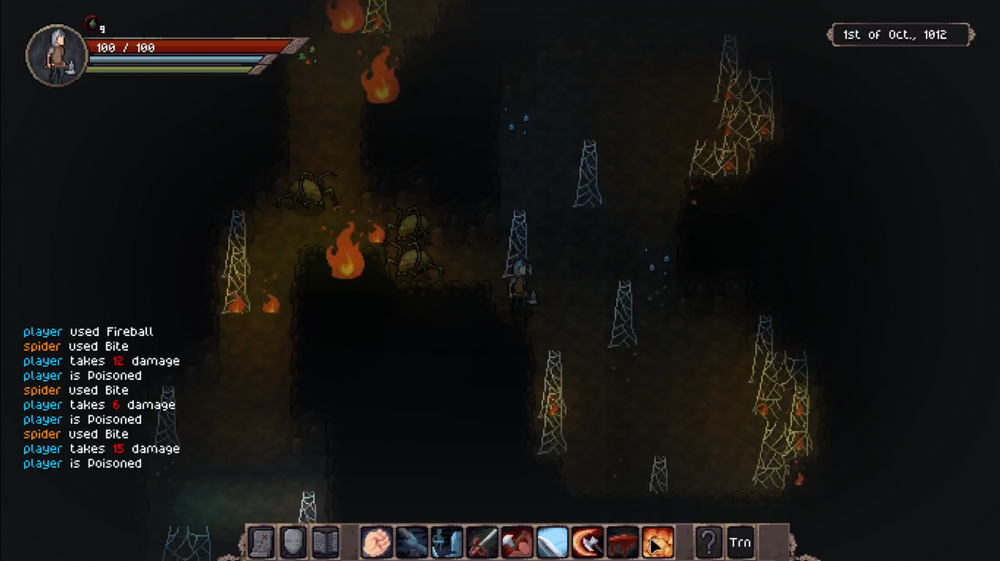

Hey everyone!

Version 0.5.0 is now available for download as an alpha version!

In this update, the focus was on creating a new enemy and dungeon, and evolve the systems in the game to allow for more interesting and dynamic fights.

# New dungeon

In this updating we're adding a new enemy, the Giant Spider, along with a new special dungeon and quest.

The Giant Spider is a mid to end-game enemy, with 150 health points, a poisonous bite that will slowly drain your health, and the ability to restrain the player's movement with its web.

They live deep in the caves of the world, and their nests are filled with webs that can hold you back. But fret not, you can use your attacks or fire to destroy the webs and pass without an issue. Just be sure you don't have to do that while fleeing the nest!

# Fire

I've also added a simple fire simulation - a suitable way of dealing with spiders! Fire is inflicted by the fire spells (Firebolt and Fireball) on flammable objects, and spread to nearby flammable objects. This will happen after everyone took their turns, in a new "Environmental" turn.

# Patch Notes

## Gameplay
- Fire spells now can set fire to flammable objects;
- Fire spreads to nearby flammable objects;
- Standing on fire will add the "On Fire" status effect;
- Added 2 pieces of music when in battle;
- Added a piece of music when exploring the surface;
- Added a piece of music when exploring the underground;
- Added ambience sounds for forest, caves, and towns;
- New species: Giant Spiders;
- New tile: Spiderweb (Can restrain the player when walking into it);
- New tile: Mooncup (Harvestable);
- New special dungeon for giant spiders;
- New consumable: Mooncup (Mushroom that recovers health);
- Reworked the way structures generate to allow for multi-level structures (no more disconnected cave entrances);

## Visuals
- Solid objects now block light;
- Caves now have a ceiling layer that blocks sunlight;

## UI
- When dragging an item in the inventory, the appropriate slots will now have a highlight;
- Added an outline around NPCs in turn-mode to show hostility and whose turn is it;
- Added tooltips to status effect moodles;

## Balance
- The difficulty of a quest is now shown in chat with the ruler, and also in the codex;
- "Reckless finisher" action had its AP and Stamina cost increased;
- Reduced the weight that distance has when selecting a quest - You're less likely to get a hard quest in the beginning now just because it is close by;
- Reduced the spawn weight of wolves and coyotes;
- Spell tomes are now rarer as quest rewards;
- Increased the healing effect of most plants;

## Performance
- Improved performance of the lighting system;

## Bugfixes
- The "C" key now correctly opens the codex;
- Fixed the blacksmith house layout (chair was blocking the entrance);
- Fixed an issue where the "Bascinet" helmet was never being generated in the blacksmith's inventory;
- Fixed the action tooltip that had way too many fractional digits;
- Actor Sprites will now show correctly above tall grass;

## Modding
- Decal objects (grasses, pebbles, etc) are now defined via a .toml file;
