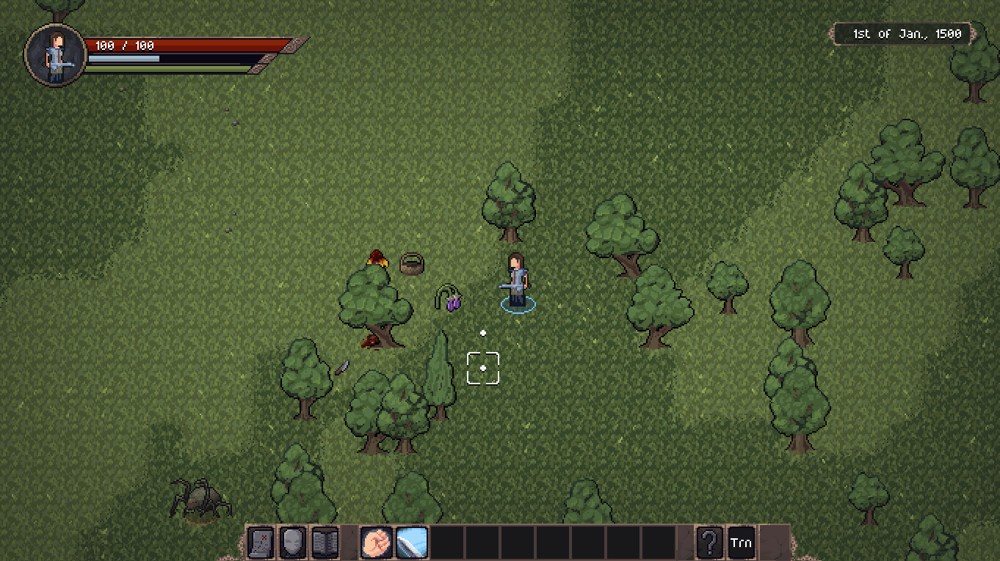
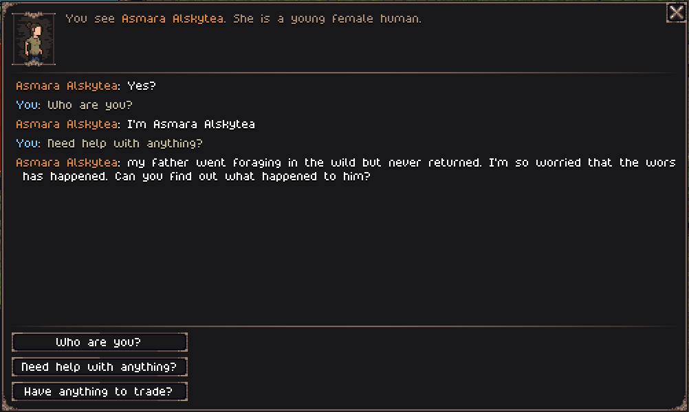

Hello everyone!

I took a couple of weeks off to travel with my family. But now I'm back, batteries recharged, and ready to continue working on the game!

In this devlog, I'll talk about the rework of the entire questing system and how quests are now generated.

## The problems with the current quests

The current quest system was always meant to be a placeholder, something to provide basic progression. But I always knew it was insufficient and, frankly, not interesting. Until now, quests were generated like this:
- Search for a nearby enemy site;
- Create a quest on the spot;
- Give the quest to the player.

Completing or not a quest has no impact on the world. They're repetitive and, most importantly, tell absolutely no story.

## The new questing system

New quests are no longer generated when you talk to an NPC. Instead, events might happen during history generation, and those events may become quests.

For example, let's look at the toy quest I developed this week. The quest is to search for a person who went missing while foraging in the forest. The whole "lifecycle" of the quest looks like this:
- Someone randomly decides to forage in the wilderness near a predator pack or bandit camp;
- They fight and end up wounded or dead, creating an encounter;
- A relative back in the city notices their disappearance and creates a quest;
- The player talks to this person and accepts the quest;
- The player investigates the area, kills the predators (maybe), and returns with the information;
- The quest is completed.

At any point during these events, the outcome might change. The person might win the battle, bringing back loot or carrying scars for life. Or maybe they don't have any relatives or friends in town, and they simply become a lonely body you can stumble upon while exploring.

The great thing about this system is that even if a quest never gets created, a story still exists. A story that can be uncovered by the player, even if just for flavor.

I used the word "encounter" several times, so let's talk about that. I borrowed the term from D&D, where it means a small modular scenario with a map, enemies, and so on. In D&D, a DM creates encounters on the fly or picks them from a list, so we don't expect them to repeat. In the game, however, scenarios are chosen from a pool of possibilities. I took a lot of inspiration from the concept of ["Zone stories"](https://pzwiki.net/wiki/Zone_stories) from Project Zomboid.

Encounters are essentially hand-made modules dropped into a procedural world. They bring flavor, style, and the developer's (or modder's) touch while keeping the replayability and unpredictability of procedural generation.

## Other changes

I also reworked the chat screen to be more functional and pleasant, although it's still not 100% complete. I've made some performance improvements and added a random event during history generation that allows people to migrate between settlements (previously each town was usually dominated by a single family).

## What's next?

I still have a few wrinkles to iron out in the new quest and encounter system, so next week I might not have much new to report besides "hey, I finished what I said last week." For the update as a whole, I plan to add a total of four encounters/quests (a 1:1 replacement for the old, boring quests) and a notice board in every city so players can find all quests in one place.

I also want to add a new lower tier for all weapon types: a club, a makeshift sword, and a lumberjack's axe. These will be cheaper and weaker than the current weapon tiers, intended as starter weapons to increase progression. This will require quite a bit of rebalancing.

This is it for this week, and don’t forget to wishlist Tales of Kathay on Steam!