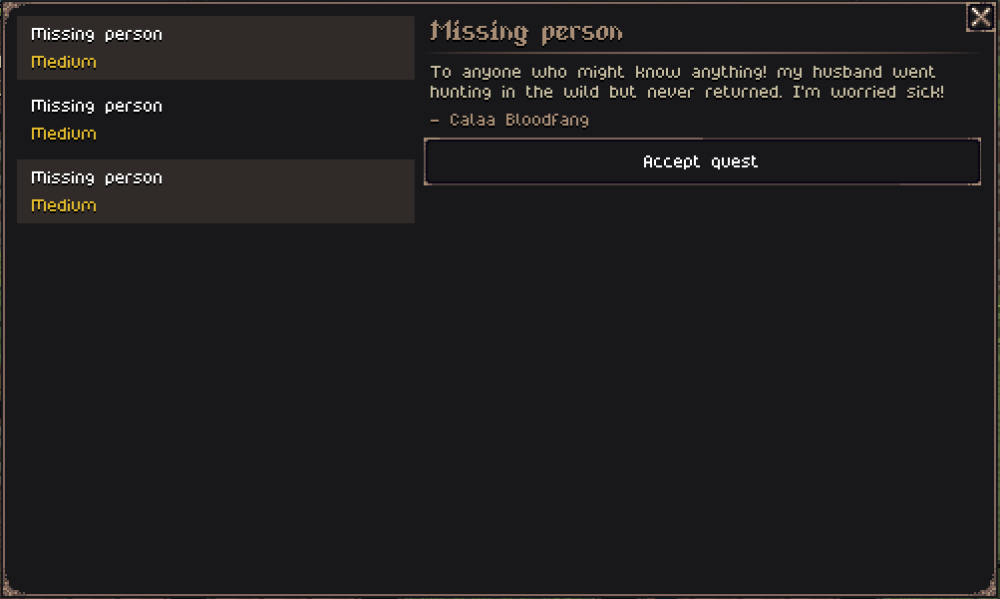
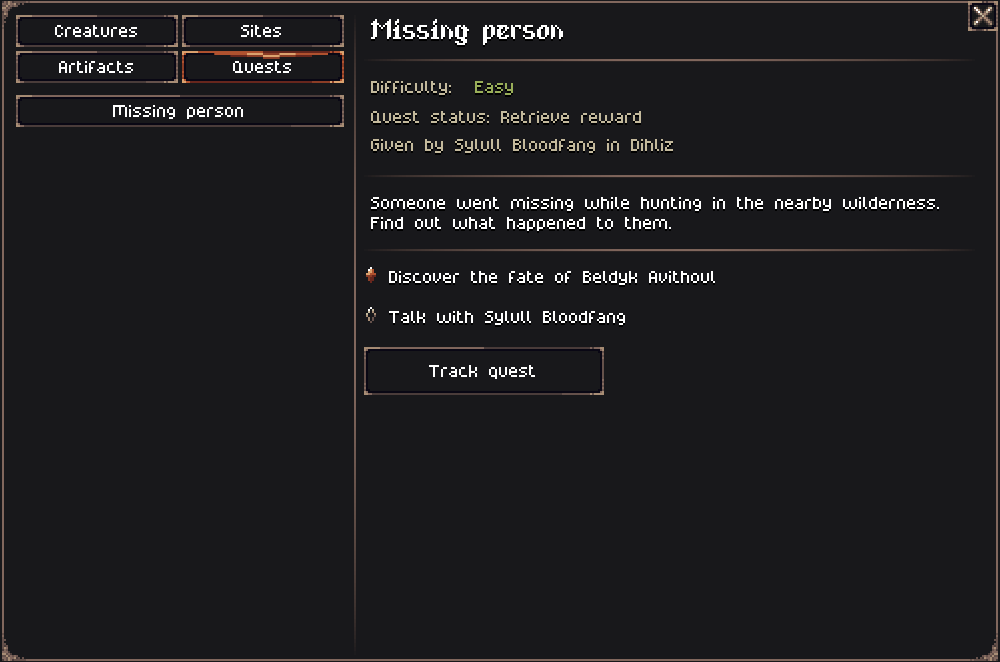
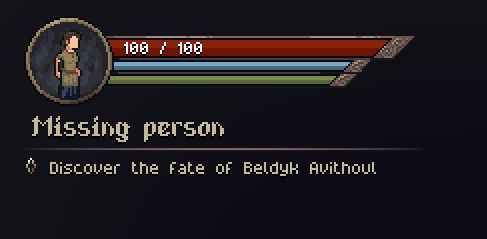
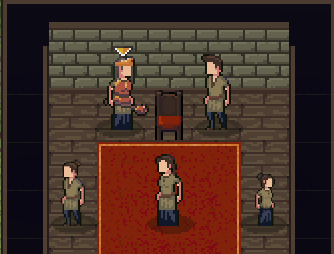

Hello everyone!

In this devlog, I continue working on the quest rework system, adding notice boards and revamping the UI for quests. If you want to know more about the quest overhaul, you can read about it in the [previous devlog](http://localhost:4321/tales-of-kathay/2025-11-14-weekly-devlog-11/).

## Notice board

Villagers may now post their active quests on the village's notice board. This gives players a way to see several quests from the current village in a single place, instead of having to talk to every NPC individually.

## New UI for quests

I've added several UI improvements to help with completing quests, all adapted to the new framework. This includes a revamp of the Codex page for quests, tracking of active quests, and quest markers on the map and in the chunk.

I don't want Tales of Kathay to become a "follow the map marker" game, but instead I want exploration to matter. So I have to be careful about how many markers I add and where. So far, I've added markers for general locations, and only for specific characters / positions when it's impossible or just boring to find them otherwise.

## Some thoughts on abstraction

I wanted to talk briefly about a realization I had while reworking the quest system about abstraction. Now, I don't mean the code type of abstraction, like interfaces or abstract classes. I mean data abstraction.

For example, when storing information about a village's population, I can do it in a few ways. I can store the distinct people in a list, with all of their properties (a concrete representation), or I can just store that the village has, for example, "5 adult males, 3 adult females, and 2 male children" (an abstract representation).

The abstract representation has a clear advantage of using less memory, and being computationally less expensive. For that reason, I've always prefered abstract representations whenever possible.

However, almost every single abstract data I have created, I eventually had to switch to concrete data, and the quest rework was no different. I had to bring several creatures that were'nt actually created, to be created on the spot. 

The main realization I had is that the concrete representation is still way faster than I thought. I can still simulate 1,500 years of history in a fraction of a second. So I have switched my mental mode to default to concrete representations, and only abstract when necessary.

## Other changes

Some other small improvements since last week are:
- Reworked (again) how quests are created to actually use bandits / predators that already exist in the world, instead of spawning them on demand.
- Added some more decorations to the "missing while foraging" quest;
- Added a new "missing while hunting" quest;
- While chating with NPCs, there's now a tree of options that you can navigate, instead of only the 3 default options;

## What's next?

The end of the quests rework is finally coming into view. I can't say for sure it'll be done next week, but I think I'm getting close. Still want to create one more quest, the lower weapon tier, and fix a few remaining bugs.

That's it for this week, and don’t forget to [wishlist Tales of Kathay on Steam](https://store.steampowered.com/app/3939340/Tales_of_Kathay/)!