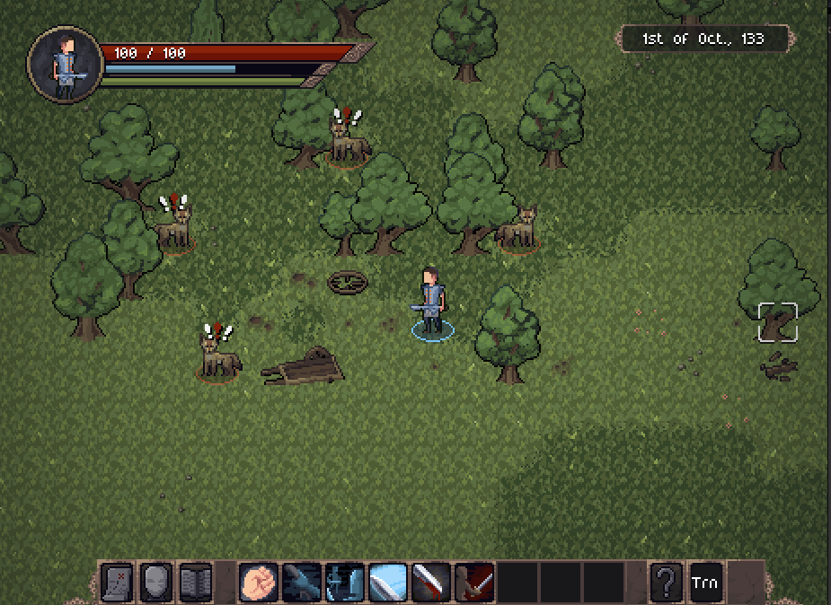

Hey everyone!

The Open Alpha 0.6.0 is now available for [download on Itch.io](https://jouwee.itch.io/tales-of-kathay)!

In this update, the focus was reworking quests for a system that is more interesting and hopefully will remain indefintely in the game.

# New quests and quests system.

The main update in this version is the quest rework.

Now, quests are created through the history simulation, based on events that happened and NPC needs and wants. To support these new quests, a new concept of "encounters" was also added. They are basically small structures that show the event in a concrete form in the world. For instance, if a caravan was attacked by a pack of coyotes, you might find their corpse, a broken cart, and some other details that tells this story. In total, 5 quests/encounters were added.

There's also the new notice board, an object that will always spawn in front of the townhall of villages, and will contain all available quests from that village.

You can still talk to people to get quests from them, and the chat screen got a new look!

## Gameplay
- Quests are now created through history, instead of on the spot;
- Quests can be given by any NPC, not only the ruler;
- Added "encounters", small temporary structures that represent some event that happened;
- New quest: Missing while foraging;
- New quest: Missing while hunting;
- New quest: Missing caravan;
- New quest: Attacked while foraging;
- New quest: Attacked while hunting;
- Added quest markers in the world map;
- Added quest markers in the game world;
- Added quest tracker underneath the HUD;
- New weapon: Makeshift Sword;
- New weapon: Woodcutter's Axe;
- New weapon: Club;
- New weapon: Small Knife;
- New console command: /travel;
- Quests now will always reward money;
- Creatures can now migrate between villages;
- Added a notice board in villages that contain postings about most quests of that village;

## UI
- Revamped the whole chat screen UI;
- Revamped the world simulation screen, adding more information;
- Revamped the quest screen in the codex;

## Performance
- Fixed small FPS hicup when moving the mouse over unpassable objects;

## Bugfixes
- Fixed some world information not being saved when you switch areas;
- Fixed crash when the game couldn't find a playable scenario. Now it'll keep simultating until a scenario is found;
- Fixed missing scroll in the codex screen;
- Fixed the player not being able to die from poison or fire;
- Fixed equipped armor texture when you looted it from another corpse;

## Modding
- Materials are now loaded from TOML file;

## Others
- Removed lore.log;
- Removed simulation of plots, goals and relationships (obsolete);
