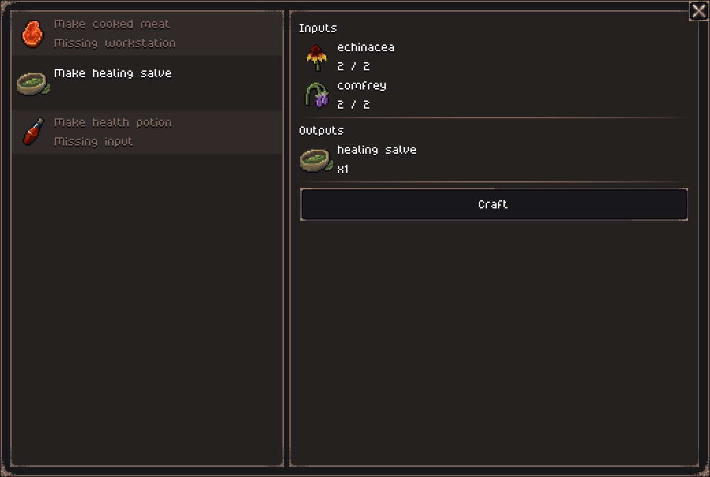

Hello everyone!

After the [release of version 0.6.0](https://jouwee.itch.io/tales-of-kathay/devlog/1125594/open-alpha-060-of-quests-hunters) last week, I quickly jumped into what I had planned for version 0.7: the creation of a basic crafting system. Now, surprisingly, this system is already pretty much done, and I plan to release version 0.7.0 probably during the weekend, so keep an eye out for that!

## Crafting

The focus of this week's work was the creation of the crafting system. I didn't focus too much on adding tons of crafting recipes and items, but just enough to test the little quirks of the crafting system.

You can now craft a few items, some of them you can craft on the go, like the new "Healing Salve" item (a weaker healing potion made with herbs), others might require workstations, such as cooking raw meat at a campfire or brewing a health potion in a cauldron.

All crafting is done in a single UI, inspired by Project Zomboid's crafting system. This might change in the future as I add different types of crafting, such as smelting ore, but for now it works nicely.

I also added a few new items to support these recipes: the healing salve, raw meat that can be harvested from animal corpses, and cooked meat. The healing salve acts as a weaker healing potion, while the meat provides a temporary boost to your melee damage.

## New quests

I have added 2 new quests based on the theme of this update. They are simple fetch quests. One is for gathering herbs for the town's herbalist, the other is to bring a healing salve to a villager who got a nasty wound.

## Other improvements

You can now use new keyboard controls for moving around using WASD or the NumPad, akin to other roguelikes. I have also added the ability to select skills in your toolbar using the number keys.

Another thing I added is a settings option in the menu to adjust volumes and other settings.

That's it for this week, and don’t forget to [wishlist Tales of Kathay on Steam](https://store.steampowered.com/app/3939340/Tales_of_Kathay/)!