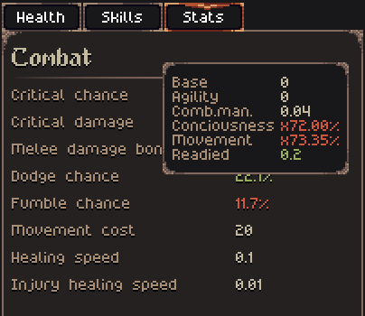
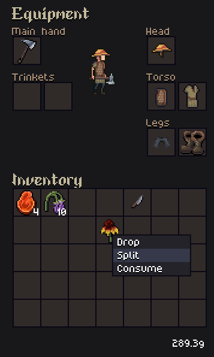

Hey everyone!

The Open Alpha 0.8.0 is now available for [download on Itch.io](https://jouwee.itch.io/tales-of-kathay)!

In this update, the focus reworking a some of the basic systems of the game into systems that can withstand the future development of the game.

# New Injuries & Health

There are now individual injuries for the body parts, instead of just a HP value per body part. Each attack causes an injury of a specific type to that body part, depleting the body part health and it's efficacy.

Each body part contributes to 3 health stats: **Manipulation** (You ability to manipulate weapons and objects), **Movement** (your ability to move around), and **Consciousness**. These stats by themselves don't change anything in the gameplay, but they affect the other stats. For example, your fumble chance will be affected by both the Manipulation and Consciousness health stats.

The new health panel reflects all of these chances:

# Stats

The player & NPC stats also got an overhaul, reworking how most stats are computed and how they work, and also adding a few new stats. Each stat will now also show everything that affects it positively or negatively when you hover over the number, such as levels, status effects, and health stats.

# Item stacks and inventory

Items can now stack! This seems like a small change, but it required to rework other things such as trading, crafting, drop, pickup, consume, and pretty much everything that revolved around items. 

I have also changed a bit how the controls of the inventory work, using now a drag-and-drop control scheme instead of a click-and-move scheme.

# Patch notes

## Gameplay
- New injury system;
- New health stats system;
- NPCs and player can now get permanent scars from injuries;
- Stats now show how their calculated on hover;
- New "healing speed" and injury "healing speed stats";
- Bonus melle damage is not a percentage instead of flat value;
- Some items can now be stacked in inventory;
- Inventory now uses drag controls instead of click-and-move controls;
- Trade dialog now show stacks instead of individual items, allowing you to buy and sell a whole stack at once;
- Environmental and status damages are now loged in the game log;

## Visuals
- New sprite for the boots;
- Improved AoE preview;

## UI
- Game log now has scroll and new colors;
- You can now view NPCs and corpses injuries upon inspecting them;

## Balance
- Rebalanced pretty much all status-effects, damages, and health for the new systems;

## Bugfixes
- Fixed an issue where you could close the death dialog and continue playing;
- Corpses can now overlap eachother, instead of being replaced;
- Fixed some issues with lingering tooltips;
- Settlements will no longer have duplicate names;
- Fixed the description for the broken bow;
- Fixed issue where you couldn't complete a in-progress quest if the NPC had another quest to give;

## Modding
- Ground tiles are now loaded from TOML files;
