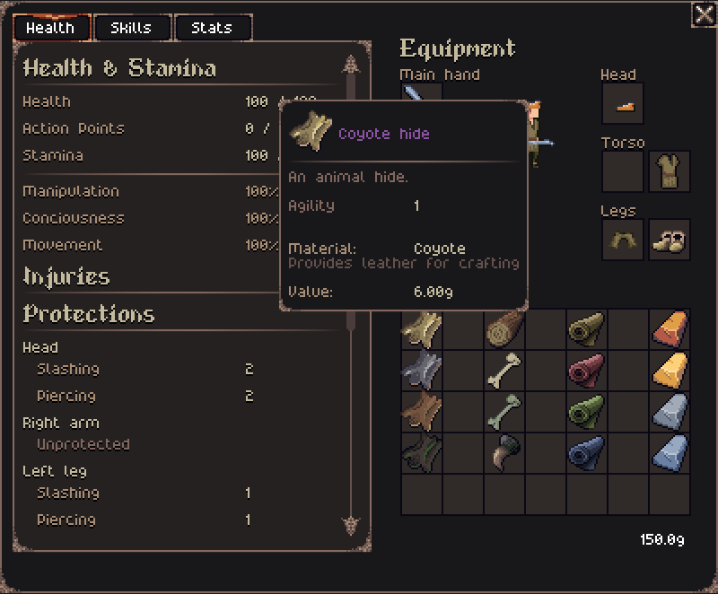
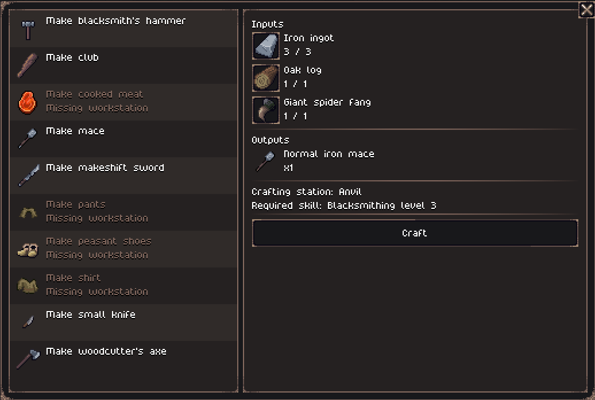
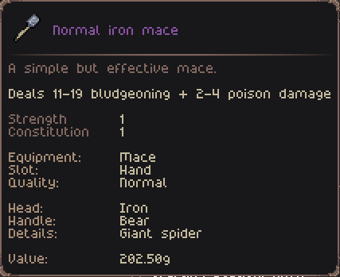
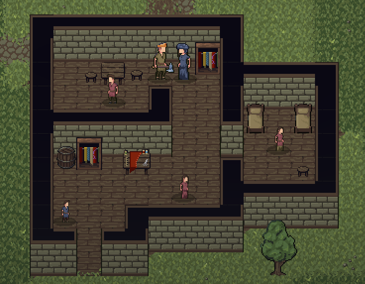

Hey everyone!

The Open Alpha 0.9.0 is now available for [download on Itch.io](https://jouwee.itch.io/tales-of-kathay)!

In this update we expand the crafting system, adding blacksmithing and tailoring, as well as specific skills for different crafting types. There are several new materials with unique properties, new armor pieces, and multiple new crafting recipes.

# Obtaining materials

The largest change in gameplay from this update is working and progressing throught different materials. You can now collect hides, bones, purchase linens and metal ingots, all with different properties and bonuses. Mix and match all of these materials into the equipment you craft, inching closer to thew perfect build.

**Hides and bones** can be aquired by butchering the corpse of different animals that you'll encounter through your playthrough. Bones can be used in certain weapons as handles, hilts or pommels. The hides are the primary material for most leather armor. **Ingots** can be purchased from blacksmiths, and are the primary material for weapons and metal armor; **Wool and linens** can be purchased from the new Tailor craftsman, and are used for clothing and cosmetic items. And **logs** can be harvested from trees, as long as you have an axe.

# Expanded Crafting

The crafting system has been expanded to support these new materials. Most equipment in the game are now craftable, and the recipes are unlocked as you progress through the respective skill: Blacksmithing, Tailoring and Survival. Your level will also affect the quality of the produced item.

The item tooltip has also got a lot of love, showing pretty much all underlying information, such as bonuses, damage, value, quality, materials used, etc.

# Tailor

You can now find tailors in towns and villages. They sell all sorts of clothing items, leather armor and cloth rolls for your own crafting. They might also request animal hides from time to time!

# Patch notes

## Gameplay
- Crafting recipes can new have a skill requirement;
- The quality of created items depends on your level on that skill;
- New skill - Survival;
- New skill - Blacksmithing;
- New skill - Tailoring;
- Added hides, bones and gans as possible outputs from butchering creatures, each with unique bonuses;
- Materials used on weapons and armor can now give boosts to attributes, damage and/or protection;
- Improved item tooltips to show all effects and bonuses;
- Some animals can now spawn randomly in the wilderness;
- The quality of the items created by NPCs now depend on their level;
- You can now chop trees while having an axe equipped, giving you a source of logs;
- Pants, boots and skirts now have quality and material;
- Blacksmiths now sell ingots and no longer sell leather armor;
- Crafting dialog now supports material selection;
- New item - "Cloth roll", sold by the Tailor, which provides the colored linen and wool materials;
- New item - "Hide";
- New item - "Fang";
- New item - "Bone";
- New item - "Log";
- New item - "Headwrap";
- New item - "Peasant Shoes" (lower level than Boots);
- New item - "Padded Chausses" (higher level than Pants);
- New Tailor profession;
- New Tailor Shop building;
- New fetch quests for hides;

## Visuals
- Fixed the colors of some materials (linens);

## UI
- Attributes are now shown in the character screen;
- Improved the description of injuries when inspecting a corpse or creature;
- The character stats screen now updates periodically and when changing equipment;

## Balance
- XP gain is now slightly slower;
- Rebalanced some variables of quest generation to reduce the number of empty encounters (quest with no enemies);
- Reviewed the price of several items;
- Fixed the healing of Echinacea, as it was too powerful;
- "Missing while hunting" encounter can now spawn some hides and meat;
- Critical Chance is now negatively affected by Manipulation;
- Crafting Healing salve now requires Survival lvl 1;
- Crafting Health potion now requires Survival lvl 4;

## Bugfixes
- Fixed the name of the blue linen (was called green linen);
- Fixed issue where quest was auto-completed when starting the game (if it was related to he player);
- Fixed issue where quest was given by the player themselves;
- Fixed issue where the butcher action could remove the wrong corpse;
- Fixed issue where the screen wasn't being cleared when out of the map;
- Fixed issue where you couldn't equip 2 trinkets;
- Fixed "Wait 50 years" death option not waiting 50 years from now, but from the original simulation lenght;
- Fixed some lingering context menus;
- Fixed some duplicate spawning of items and corpses in encounters;
- Fixed the render order of some objects (ground objects being drawn in front of the player);
- Fixed wrong information on the help screen;

## Modding
- Actions can now be defined via TOML file;
