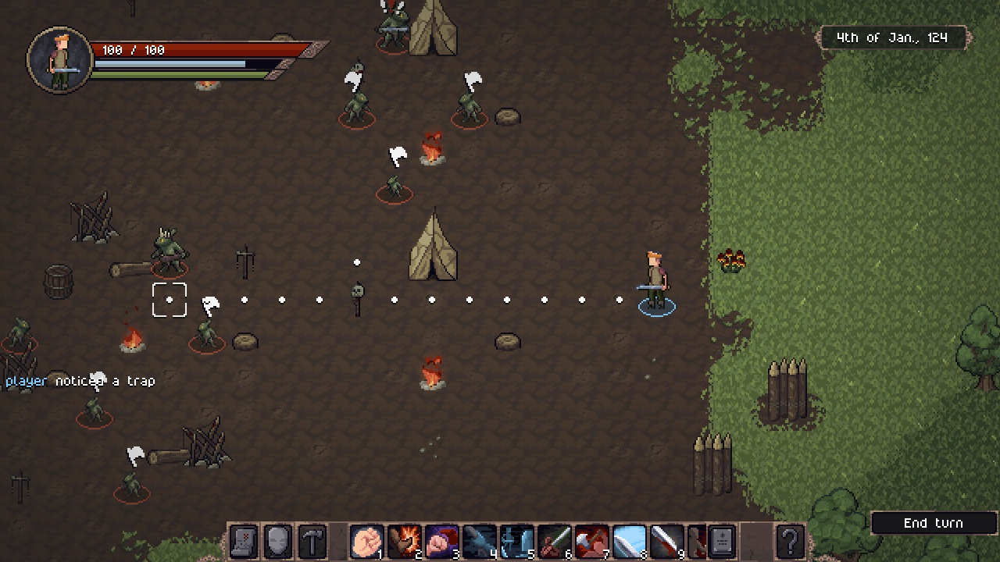
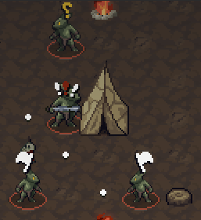
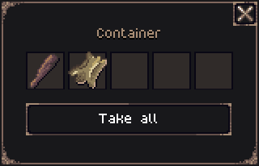

Hey everyone!

The Open Alpha 0.10.0 is now available for [download on Itch.io](https://jouwee.itch.io/tales-of-kathay)!

In this update we focus on adding a new full-fledged tribal species to the game, the **Grokker**! We also add lootable containers, traps, and AI improvements.

# Grokkra

The grokkra are small humanoid creatures, hostile towards humans, but not very technologically advanced. They live in small tribes, and rely on makeshift weapons, slings, and crude traps.

However, they have a skill that no human can replicate, they can create "Grokker Amber": A dried and polished resin that they make from their bodies. It's better not to think much about it, but it has some unique properties when imbued into weapons!

Grokkra will often attack human settlements, and you can likely find village leaders with open contracts for the grokker leader!

To support the grokkra, they have access to a new weapon: the sling. It is not very powerful, but allows you to attack from a distance - useful good in group tactics. They also have access to two new traps, hidden dangers that can take anyone sneaking around the camp by surprise!

# AI Changes

The AI has undergone some changes to make the combat vs the semi-intelligent grokkra more interesting. Aggroed NPCs will now get the attention of nearby NPCs, that will investigate what's going on. Children and other weak NPCs will also now prefer fleeing over fighting the player.

# New lootable containers

Barrels are now lootable, opening a small screen that allows you to pickup what you want. You can't place items into the container yet, though. Barrels will have loot in Grokker camps at the moment.

# New Intuition attribute & Perception stat

To support the new trap mechanics, a new *Intuition* attribute has been created, and the "Perception bonus" that is derived from it. The perception bonus will allow you to spot traps more easily.

# Patch notes

## Gameplay
- New species: Grokker;
- New site type: Grokker tribe;
- New quest: Slay Grokker Leader;
- New traps: Wooden Spike and Bone Chimes;
- New item: Sling;
- New item: Bone Crown;
- New item & Material: Grokker Amber;
- New action: Slingshot (Ranged attack when Sling is equipped);
- New Attribute: Intuition;
- New Stat: Bonus perception. Depends on Intuition, helps to perceive traps;
- New tile: Palisade wall;
- New tile: Stake blockade;
- New tile: Crude bedroll;
- New tile: Sitting log;
- New tile: Sitting stump;
- New tile: Skullspike;
- Barrels are now lootable, although they'll only have loot in Grokker camps;
- NPC turns are now slightly slower;
- You can no longer fast-travel while in combat;
- Tribes randomly attack villages;
- New /loadout command for testing;
- Aggroed NPCs will now call the attention of nearby NPCs;
- Children will now prefer fleeing instead of fighting to the death;

## Visuals
- New visuals for the patchy grass sprite;

## UI
- World map shows some information about a site on hover;
- Trade screen no longer resets scroll upon trading;

## Balance
- You are guaranteed to have an easy quest on the starting village;
- Reduced wolf HP and damage very slightly;
- Increased price of boots and some hides;
- Improved the site spawn positions for a more diverse world;
- Reduced "crit damage bonus" stat base value from 200% to 150%;
- Reduced Strength effect in "Melee Damage Bonus" stat;

## Performance
- Improved the performance of the Quests tab in the Codex;

## Other
- Crashes now record the error on the log;
- Options are now saved and restored;

## Bugfixes
- Fixed fireball firing several projectiles;
- Fixed scroll rendering in some cases;
- Fixed "Pickup" action being prioritized over "Strike" action (You no longer pick up an item from beneath an enemy's foot instead of attacking it);
- Fixed issue where NPC would try to do an action before the previous one was done, cancelling it;
- Fixed some typos (Thanks @Heliostics);
- Fixed text clipping issues in some computers (Thanks @BadlyChosenName and @Gradir);
- Fixed the text of some hunting quests;
- Fixed tooltips covering context menus;
- Fixed duplicate quests being created;
- Fixed enemies attacking your corpse after you died;
- Fixed the Recovery stat bonus from items;
- Fixed destroying objects that emit light not removing the light source;
- Fixed some materials not showing all effects on tooltip;

## Modding
- Cultures are now loaded from TOML files;
- New TOML file for tribe site definition;

[Wishlist Tales of Kathay on Steam](https://s.team/a/3939340?utm_source=website_update)