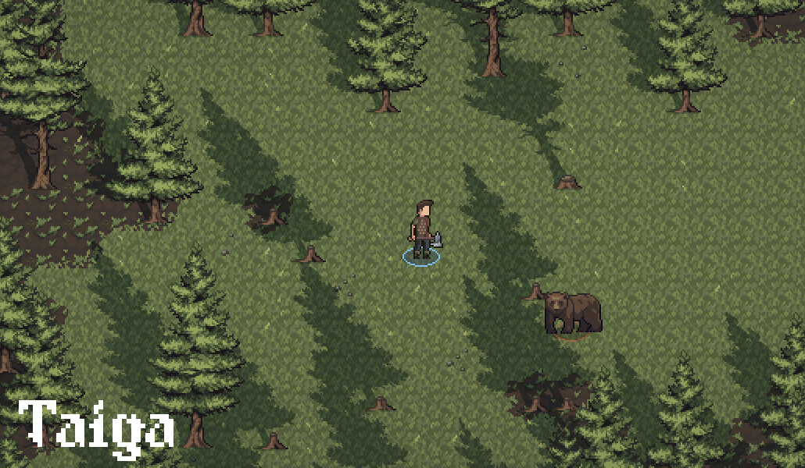

Hey everyone!

The Open Alpha 0.11.0 is now available for [download on Itch.io](https://jouwee.itch.io/tales-of-kathay)!

In this update I've reworked the biomes of the game, making them more distinct, and adding a third biome: The Taiga.

# New biomes

Previously, the biomes only had a tiny impact on the game, changing the sprite in the map screen, and choosing what creatures to spawn. 

Now, they're truly different from one another. Each biome can generate different trees, plants and animals, with different densities. The 3 current biomes are:

**Temperate Prairie**

Previously called grasslands, this biome is rich in healing herbs and coyotes, but you won't find many trees around. Grokker really like to live here.

**Temperate Deciduous Forest**

Previously called forest, this biome is composed of dense oak and birch woodlands populated by wolves and bears.

**Taiga**

The new biome, a cold forest composed mostly of pines. Grokker avoid the colder regions, leaving it for the wildlife and the terrifying Varningr.

# Challenge Rating

Quest difficulty has been reworked to revolve around a concept or Challenge Rating, or CR. The CR is a score computed for every quest, and also for the player, and it's an estimate of how hard a fight will be. A high CR creature has a higher chance of winning against a low CR creature. The quest difficulty is based on the difference between your own CR and the quests CR.

# Patch notes

## Gameplay
- "Cleave" action now doesn't require targeting a creature;
- Biomes now vary vastly between eachother;
- Changed how temperature and rainfall are generated in World gen;
- Quest difficulty is now measured in "CR" (Challenge Rating), compared to the player's own CR;
- New oak tree sprite;
- New tree: Birch;
- New tree: Pine;
- New harvestable plant: Witch Hazel;
- New harvestable plant: Goldenseal;
- New harvestable plant: Yarrow;
- New harvestable plant: Devil's Bush;
- New grass color for prairie;
- New biome: Taiga;
- Trees now drop their own materials (cosmetic only);
- New craftable potion: Tonic of Vigour (Increases strength);
- New craftable potion: Tonic of Envigoration (Increases agility);
- New craftable potion: Tonic of Attentiveness (Increases intuition);
- New craftable potion: Tonic of Sturdiness (Increases constitution);

## Visuals
- Improved some visual effects of the teleport spell;
- Added shadows to tall objects like trees;
- Large objects are now hidden when over the player or the cursor;

## UI
- Biome is now shown when hovering over a Point of Interest on the map;

## Bugfixes
- Fixed issue where the quest marker was shown behind the hotbar;
- Fixed issue where the map didn't start centered on the player;
- Fixed issue where the date could be zero ("0th of Jan");
- Fixed crash on trade dialog (Thank you Heliostics!);
- Fixed rare crash while on combat (Thank you Gilbert!);
- Fixed issue where status effects could take the HP lower than 0;
- Fixed lingering tooltips from the map screen;
- Fixed issue where completing a fetch quest didn't refresh the Chat options;
- Fixed issue where completing a quest completed several other quests;
- Changed how definitions are loaded, shouldn't conflict between versions anymore;

[Wishlist Tales of Kathay on Steam](https://s.team/a/3939340?utm_source=website_update)