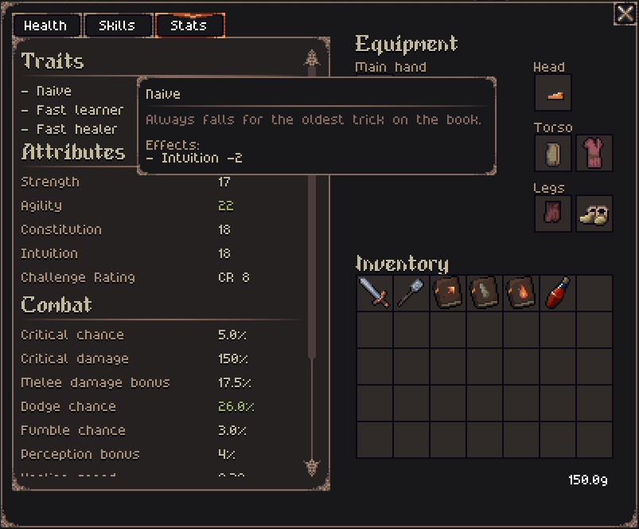
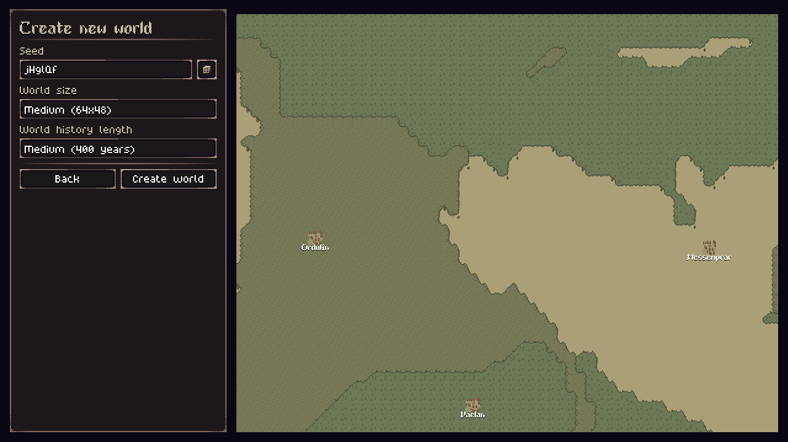
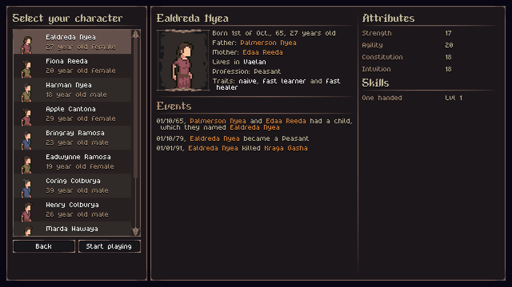
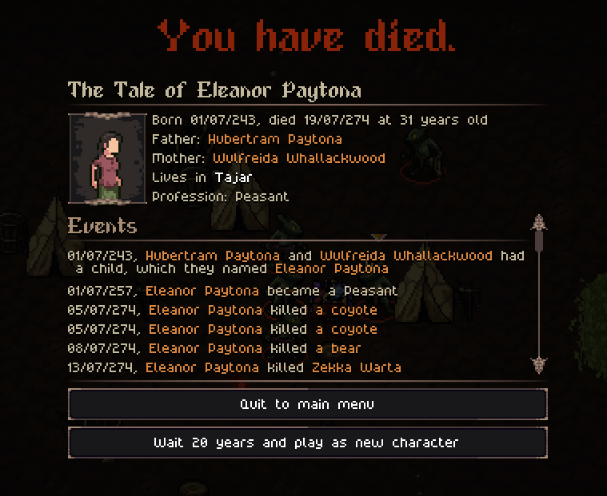
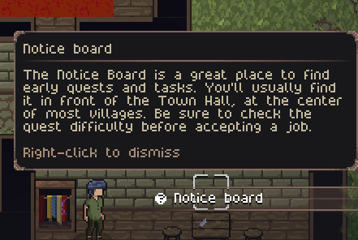

## Important update about the Open Alpha

I'll be ending the Open Alpha for Tales of Kathay shortly, transitioning to a Closed Alpha exclusive for [Patreon](https://www.patreon.com/cw/Jouwee) supporters.

You'll still be able to play a demo version of the game for free on Itch, with limited options for world size and playthrough duration.

The game will still be updated regularly, but the access will be restricted to Patreon supporters of any paid tier.

To continue playing the updated versions of Tales of Kathay, consider becoming a member on [Patreon](https://www.patreon.com/cw/Jouwee). **I still have a few updates planned for the Open Alpha, so you can wait a bit before becoming a member.**

If you have donated through Itch, I'll figure out a way for you to still have access to the updated Alpha versions.

-----------

Hey everyone!

The Open Alpha 0.12.0 is now available for [download on Itch.io](https://jouwee.itch.io/tales-of-kathay)!

In this update I'm adding a new system to the game, called Traits. All characters spawn with randomized traits that gives them bonuses or penalties, making each character more unique. In total, 12 traits were added.

I've also polished the player experience around the actual game, like creating a new Crate World screen, character selection and death screen.

Finally, there's now an in-game contextual hint system to help new players better grasp the concepts of the game.

# Traits

Every character in the world will now have randomized traits, that modify their attributes, stats, and how likely they are to perform certain actions. 

In total, there are 12 traits added, with 6 of them being positive, and 6 being negative. From some simple attribute changing traits, such as the Strong trait, that gives you to +2 Strength, to the Slow Learner trait, that reduces XP gain by 20%.

# New World, Character Selection and Death screens

I've added new screens for creating worlds, character selection, and after your character has died. These new screens not only are there to give clarity and context to what the game is doing, but also gives the player new options on how to play the game.

The "New World" screen allows you to select the world size and history length, as well as the world's seed, if you want to replay a particularly interesting world.

The "Character Selection" screen gives you a roster of characters from the world to choose from, instead of the game randomly assigning one to you. You can carefully select the best character for you, viewing their traits, attributes and starting skills. Or you can select someone with a particulary interesting backstory, based on their life's events.

Finally, I have revamped the Death screen to be more impactfull, and recount the Tale of the played character.

# Contextual Hints

There's now a few hints that might pop up during play, with the intent to help new players get a grasp of the game mechanics. These hints also replace the content of the Help Screen, and will only show once per playthrough.

# Patch notes

## Gameplay
- New help screen;
- New death screen, that shows events in the character's life;
- New trait system, that gives slight advantages and disadvantages to differenct characters;
- New Trait: Though;
- New Trait: Puny;
- New Trait: Strong;
- New Trait: Weak;
- New Trait: Nimble;
- New Trait: Sluggish;
- New Trait: Street Smart;
- New Trait: Naive;
- New Trait: Fast Healer;
- New Trait: Slow Healer;
- New Trait: Fast Learner;
- New Trait: Slow Learner;
- New Stat: Experience Multiplier;
- New (optional) tracking of in-game events;
- New "Create World" screen;
- New "Character Selection" screen;
- Improved people name generation to be less random;
- Increased the likelihood of blacksmiths and other traders in towns;
- Interacting with a crafting station in the world now opens the crafting menu;

## UI
- Updated game's logo on the Main Menu;
- Stacking items is now prefered when adding an item to your inventory;
- New Filters on the Crafting screen for the required crafting station;
- Pressing a screen hotkey again with the screen open closes it;
- Codex no longer shows unnamed creatures (e.g.: "a wolf", "a bear"...);
- Trade dialog now shows if an item is equipped or not;
- Tooltip's delay has been reduced;
- Improved the text of several world events;
- Quest markers are now animated;
- Small UI changes in the History Simulation screen;
- Added small indicator of when you run out of Action Points;
- Quest reward value is now shown on the Notice Board;
- New contextual hints during gameplay;

## Performance
- Saving the game is now done in the background, drastically reducing the load time between areas;

## Balance
- "Cleave", "Bleeding Cut" and "Concussing Strike" cooldown changed from 2 to 3;
- Increased XP gain slightly;
- Made traps less obvious, not changing the underlying ground;
- HP recovery was greatly increased;
- Increased the Club's damage slightly;
- Rebalanced most action's Action Points cost. Most importantly, movement now costs 25 AP (4 tiles / turn), and most attacks cost 50 AP;
- Constitution affects the "Healing Speed" stat;
- Weapon's 2nd level skills have been moved to level 1;

## Bugfixes
- Fixed the Sling tooltip's damage;
- Fixed several typos;
- Fixed issue where NPCs would change hair style upon reloading an area;
- Fixed issue where the chat dialog no longer had any options;
- You can no longer track completed quests;
- Fixed issue where the Alt key ("Look") got stuck;
- Grokkers no longer spawn in the Taiga biome, as originally intended;
- Fixed issue where encounters were overriding each other, causing some impossible to complete quests (Thanks @Gilbert!);
- Fixed issue where the sliders in the "Options" screen had no background;
- Fixed some Tonic crafting recipes that were misconfigured;
- Fixed crash when spawning enemies via the /spawn command;
- Fixed teleport having no cooldown;

[Wishlist Tales of Kathay on Steam](https://s.team/a/3939340?utm_source=website_update)

